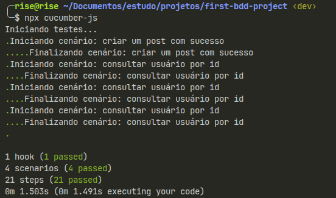

# QA BDD API Tests

Suíte de testes automatizados de API, escrita em **BDD (Behavior-Driven Development)** com **Cucumber.js** e **Gherkin**, aplicada sobre uma API REST pública.

Projeto criado como prática dos estudos de QA, com foco em consolidar os conceitos de Gherkin (Feature, Scenario, Background, Scenario Outline, Examples, Data Table) aplicados a um cenário real de testes de API.

---

## 🎯 Objetivo

Praticar a escrita de especificações em Gherkin e sua automação com Cucumber.js, validando endpoints de uma API REST pública quanto a:

- Status code das respostas
- Estrutura e conteúdo do corpo (JSON) retornado
- Comportamento em cenários de sucesso e de erro

Este projeto faz parte da minha trilha de estudos para me tornar QA Júnior.

---

## 🛠️ Tecnologias utilizadas

- **JavaScript**
- **Cucumber.js** — execução dos testes BDD
- **Node.js**
- **Fetch/Axios** (chamadas HTTP)
- **[JSONPlaceholder](https://jsonplaceholder.typicode.com/)** — API pública utilizada como alvo dos testes

---

## 📁 Estrutura do projeto

```
first-bdd-project/
├── features/
│   ├── users.feature
│   └── posts.feature
├── steps
│   ├── users.js
│   └── posts.js
├── support
│   └── hooks.js
├── package.json
├── cucumber.js
└── README.md
```

---

## ✅ O que é testado

| Feature         | Cenários cobertos                                                                                   |
| --------------- | --------------------------------------------------------------------------------------------------- |
| `users.feature` | Busca de usuário por ID (sucesso e usuário inexistente), usando **Scenario Outline** e **Examples** |
| `posts.feature` | Criação de post com dados via **Data Table**, validando status e corpo da resposta                  |

---

## ▶️ Como rodar o projeto

Pré-requisitos: [Node.js](https://nodejs.org/) instalado.

```bash
# Clonar o repositório
git clone https://github.com/rodrigodvalente/first-bdd-project.git

# Entrar na pasta do projeto
cd first-bdd-project

# Instalar as dependências
npm install

# Rodar os testes
npx cucumber-js
```

---

## 📸 Evidência de execução



---

## 📚 Principais aprendizados

- Estrutura e sintaxe do Gherkin (Feature, Scenario, Given/When/Then/And)
- Diferença entre `Scenario Outline` + `Examples` e `Data Table`
- Uso de Hooks, para executar funções antes e após cenários
- Boas práticas de escrita de cenários (nível de abstração de negócio, dados reais em vez de descrições)
- Integração entre especificação (`.feature`) e código de automação (step definitions) via Cucumber.js
- Validação de API REST: status code e estrutura de resposta JSON

---

## 👤 Autor

Feito por Rodrigo Drumond Valente como parte da trilha de estudos para QA Júnior.

[LinkedIn](https://linkedin.com/in/rodrigodrumondvalente)
